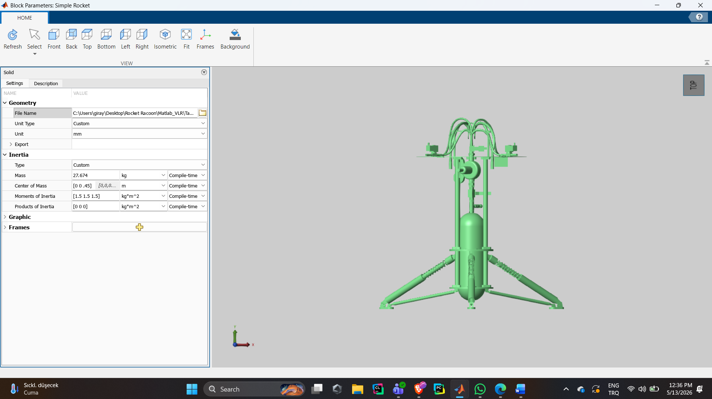

# VTOL-Pneumatic-Rocket

Vertical landing pneumatic rocket algorithm — TEKNOFEST hybrid/pneumatic rocket suicide-burn landing project (Propulse Aviyonik).

The rocket free-falls (or descends under drag) from a fixed altitude and must land under a strict touchdown-speed limit (0.2 m/s in the current TEKNOFEST specification, down from an earlier 2.0 m/s limit) using a single on/off (or PWM-throttled) main valve for vertical braking and cold-gas RCS thrusters for attitude (pitch/roll) control. This repo tracks the control-algorithm iterations, the offline/online trajectory optimization work, and the vehicle's 3D geometry.

## Structure

- **`control/`** — closed-loop landing controllers, in rough chronological/design order:
  - `rcs_attitude_lqr_demo.m` — 6-DOF attitude control panel prototype: per-axis LQR on `[angle; rate]` driving a 4-thruster RCS allocation matrix, plus a suicide-burn trigger for the main engine. Mainly a visualization/analysis dashboard (altitude, orientation, RCS valve timing, fuel economy).
  - `hybrid_altitude_lqr.m` — first altitude-axis "hybrid" controller: analytic suicide-burn trigger hands off to an LQR-based hover/terminal-descent law with valve hysteresis and an anti-bounce lockout.
  - `ladrc_option1_late_brake.m` — LADRC (Linear Active Disturbance Rejection Control) on all three axes (z/pitch/roll) with PWM on/off valve quantization; "Option 1" strategy (free-fall until 2 m, then hard brake).
  - `ladrc_option3_velocity_profile.m` — same LADRC/PWM structure as `ladrc_option1_late_brake.m`, but "Option 3": a continuous altitude-dependent velocity reference (linear interpolation from -2.0 m/s to -0.2 m/s) instead of a two-phase brake, plus LQR state feedback (fed by the LADRC's extended state observer) on the pitch/roll axes.
  - `landing_controller_v6.m` — current best/flagship version: adds a 350 ms valve-opening delay to the plant model and a delay-predictive trigger (fires the suicide burn early enough that the *post-delay* state lands exactly on the optimal braking curve), plus a low-altitude PD hover phase. Reports ~0.15 m/s landing speed and ~59% fuel remaining vs. ~5.7% in earlier versions.
  - `rocket_monte_carlo.m` — robustness sweep: re-runs the `ladrc_option3_velocity_profile.m`-style LADRC+LQR controller 20 times with randomized mass (+/-10%), inertia (+/-15%) and wind-gust intensity to estimate the specification-compliance rate under real-world uncertainty.
- **`mpc/`** — nonlinear MPC (`nlmpc`, Model Predictive Control Toolbox) approach as an alternative/complementary strategy to the LADRC line above:
  - `mpc_single_shot.m` — single-shot nonlinear MPC trajectory + control computation for a free-fall-to-landing maneuver (7-state planar model: position/velocity/attitude/mass, 2 inputs: main thrust + RCS force).
  - `mpc_offline_tracking.m` — two-stage version: MPC computes an optimal offline reference trajectory once (with a more realistic dynamics model including ground effect and aerodynamic drag), then a lightweight PD tracking law follows that reference in closed loop — avoiding the cost of solving the NLP online.
  - `rocket_rcs_dynamics.m` — the simplified 7-state nonlinear dynamics function (`dxdt = f(x,u)`) used as the MPC prediction model in `mpc_single_shot.m`.
- **`utils/`**
  - `pwm_quantize.m` — maps a normalized 0-1 throttle command to the nearest available on/off PWM duty-cycle pattern (10-slot window), used by the LADRC controllers and the Monte Carlo sweep. This is the single shared copy; the control scripts add it to their MATLAB path at startup instead of each carrying a private copy.
- **`geometry/`** — vehicle outer-mold-line generation:
  - `rocket_parameters.m` — generates CST (Class-Shape Transformation) parametrized cross-section profiles for the rocket body sections and saves them to `Rocket_profiles.mat`.
  - `Rocket.m` — lofts the CST profiles (plus a pointy-nose section) into a 3D body definition, used for CAD/mesh generation.
  - `Rocket_profiles.mat` — cached profile data produced by `rocket_parameters.m` and consumed by `Rocket.m`.
  - `Rocket.stl` — exported 3D mesh of the vehicle outer geometry.
- **`simulink/`**
  - `simpleTVCRocketModel.slx` — Simulink block-diagram model of the vehicle plant (and/or TVC control loop); `.slxc` is MATLAB's auto-generated model cache, kept alongside for reference but safe to delete/regenerate locally.

## Requirements

MATLAB with the Control System Toolbox (`lqr`) and, for the `mpc/` scripts, the Model Predictive Control Toolbox (`nlmpc`). Add the repo root to the MATLAB path (or just `cd` into it) before running any script, since the `control/` scripts locate `utils/pwm_quantize.m` via a path relative to their own file location.

## Status

`control/landing_controller_v6.m` is the current reference controller (meets the 0.2 m/s specification with a comfortable margin per its own logged results). The MPC line (`mpc/`) is being explored as a way to get provably-optimal fuel/attitude trade-offs rather than the LADRC line's hand-tuned bandwidths, but is not yet the flight controller.
